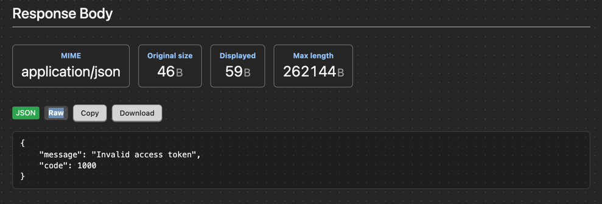

[](https://scrutinizer-ci.com/g/savinmikhail/symfony-profiler-response-bundle/?branch=main)
[](https://scrutinizer-ci.com/g/savinmikhail/symfony-profiler-response-bundle/?branch=main)


## Symfony Profiler Response Bundle

Dev-only Symfony bundle that adds a "Response Body" panel to the Web Profiler, showing JSON/text response payloads with size limits and sensible guards.

Features
- Captures response body for textual and JSON-like MIME types
- Skips streamed/binary responses to avoid breaking downloads
- Truncates large payloads (default 256 KB) to protect the toolbar
- Pretty-prints JSON when possible

### Installation
1. Install the bundle:
    ```bash
       composer require --dev savinmikhail/symfony-profiler-response-bundle
    ```

2. Copy the configuration file:
    ```bash
       cp vendor/savinmikhail/symfony-profiler-response-bundle/config/packages/response_profiler.yaml config/packages/
    ```

3. The bundle will be automatically registered by Symfony Flex.

### Usage
- In the Web Profiler, open any request and look for the new "Response Body" tab.
- The toolbar badge shows MIME and size; the panel shows headers and the (pretty-printed) body, truncated if oversized.

Appearance



Notes
- This bundle is designed for development. Do not enable in production.
- Streamed and binary responses are ignored.
- Pretty-printing of very large JSON may be skipped when payloads are huge.
